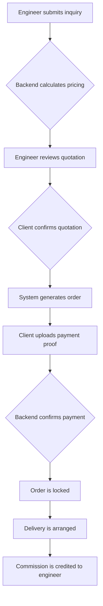

# Implementation Plan: Engineer Commission Model and App Enhancements

This document outlines the plan for implementing the new Engineer Commission Model and enhancing the JengaMate app.

## 1. Overall Workflow Design (Engineer Commission Model)

## 2. APP Features to Add/Improve

### 2.1 Inquiry Submission Interface
- [ ] Enhance the inquiry submission form to support multiple product entries.
- [ ] Add fields for Product Type, Thickness, Color, Length, Quantity, and Remarks.
- [ ] Add an "Upload Drawings" button.
- [ ] Add a section for Project Info, including Project Name, Delivery Address, Expected Delivery Date, and a checkbox for "Transport Needed".
- [ ] Implement the "+ Add Product" button to allow users to add multiple items to a single inquiry.

### 2.2 Inquiry List Page + Inquiry Detail Page
- [ ] Create a new screen to display a list of inquiries.
- [ ] The list should display the Inquiry ID, a summary of the products, the date, and the status (Pending, Quoted, Cancelled).
- [ ] Create a new screen to display the details of an inquiry.
- [ ] The detail page should show the full product details, the current status, and whether the inquiry has been quoted.

### 2.3 Quotation Review + Confirmation Interface
- [ ] Create a new screen to display the details of a quotation.
- [ ] The quotation details should be clearly displayed, with the commission hidden from the engineer.
- [ ] Add "Confirm Quote" and "Request Modification" buttons.
- [ ] When a quote is confirmed, the system should generate an order number in the format "SO2025-xxxx".

### 2.4 Payment Interface
- [ ] Enhance the payment interface to display the total amount to pay and the company's bank account details.
- [ ] Allow users to upload multiple payment screenshots.

### 2.5 Partial Payment Logic Handling
- [ ] Implement logic to handle partial payments.
- [ ] Each payment record should include the amount, time, and payment method.
- [ ] The system should automatically sum all payments and compare the total with the order amount.
- [ ] The order status should be updated to "Partially Paid" or "Fully Paid" accordingly.
- [ ] The backend should provide a clear breakdown of all payment records.

### 2.6 Order Status List
- [ ] Enhance the order status list to include the following statuses: Pending Payment, Partially Paid, Paid, Shipped, Completed, Cancelled.
- [ ] Each payment and shipping step should have a timestamp.

### 2.7 Post-Payment Order Locking
- [ ] Implement logic to lock an order after payment has been made.
- [ ] Once an order is locked, the product, quantity, and price cannot be changed.

### 2.8 Commission Management System
- [ ] Ensure that engineers cannot see the commission amount in the quotation.
- [ ] After a successful delivery, the engineer should see the commission record in the "My Commission" section of the app.

## 3. Backend Feature Suggestions

### 3.1 Quotation Management Page
- [ ] Create a new page in the admin panel to manage quotations.
- [ ] Allow admins to create quotations quickly.
- [ ] Add a field to set the engineer's commission.

### 3.2 Payment Verification Page
- [ ] Create a new page in the admin panel to verify payments.
- [ ] Display the uploaded payment screenshots and allow admins to match the amount with the order total.
- [ ] Add buttons to mark payments as "Full", "Partial", or "Invalid".

### 3.3 Commission Management Page
- [ ] Create a new page in the admin panel to manage commissions.
- [ ] Display a list of each engineer's commission history.
- [ ] Show the settlement status of each commission.

### 3.4 Export Tools
- [ ] Implement a feature to export Excel reports for monthly commission reconciliation.