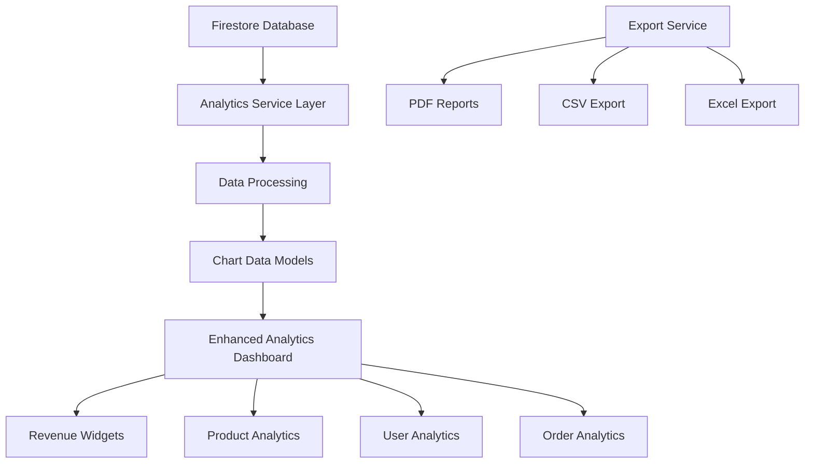

# Enhanced Analytics Dashboard Enhancement Plan

## Current State Analysis
The existing [`enhanced_analytics_dashboard.dart`](jengamate_new/lib/screens/admin/enhanced_analytics_dashboard.dart:1) provides:
- Basic platform metrics (users, orders, products, inquiries)
- Withdrawal statistics with status breakdown
- User growth chart with time range selection
- Recent activity section
- Responsive design

## Proposed Enhancements

### Phase 1: Revenue & Financial Analytics
- **Revenue Dashboard**: Total revenue, revenue by time period, revenue by category
- **Commission Tracking**: Platform commission earnings, commission rates by category
- **Payment Analytics**: Payment method breakdown, payment status tracking
- **Profit Margins**: Supplier vs platform profit analysis

### Phase 2: Product Performance Analytics
- **Top Performing Products**: By revenue, orders, views
- **Inventory Analytics**: Stock levels, low stock alerts, turnover rates
- **Category Performance**: Revenue and order volume by category
- **Price Analytics**: Price trends, competitive pricing insights

### Phase 3: User Behavior Analytics
- **Customer Segmentation**: New vs returning customers, customer lifetime value
- **Supplier Performance**: Top suppliers, supplier ratings, order fulfillment rates
- **Geographic Analytics**: Orders by region, customer distribution maps
- **Engagement Metrics**: Session duration, page views, feature usage

### Phase 4: Order Analytics Deep Dive
- **Order Funnel Analysis**: From inquiry to completed order conversion rates
- **Status Analytics**: Order status distribution and transition times
- **Cancellation Analytics**: Cancellation reasons, rates by supplier/category
- **Delivery Performance**: On-time delivery rates, delivery time analytics

### Phase 5: Advanced Features
- **Real-time Updates**: Live dashboard updates using Firestore snapshots
- **Export Functionality**: PDF reports, CSV data export
- **Custom Date Ranges**: Date picker instead of fixed ranges
- **Advanced Filtering**: Filter by supplier, category, customer segment
- **Predictive Analytics**: Sales forecasting, inventory predictions

## Technical Architecture

## Implementation Priority

1. **High Priority**: Revenue analytics, product performance, export functionality
2. **Medium Priority**: User behavior analytics, geographic data
3. **Low Priority**: Predictive analytics, advanced filtering