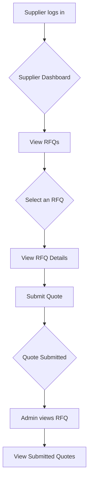

# RFQ Enhancement Plan: Streamlining the Quoting Process

This document outlines the plan to enhance the RFQ management system by streamlining the quoting process for suppliers.

## 1. Current System Analysis

The current system allows users to submit RFQs, and admins can view them. However, there is no dedicated interface for suppliers to view RFQs and submit quotes. This is a significant gap in the workflow.

## 2. Proposed Enhancements

To address this, we will implement the following enhancements:

### 2.1. Supplier RFQ List Screen

-   Create a new screen that displays a list of RFQs relevant to the logged-in supplier.
-   This screen will show key information for each RFQ, such as title, category, and deadline.
-   Suppliers will be able to tap on an RFQ to view its details.

### 2.2. RFQ Details Screen for Suppliers

-   This screen will display the full details of a selected RFQ.
-   It will include a "Submit Quote" button that opens a quote submission form.

### 2.3. Quote Submission Form

-   A new form will be created to allow suppliers to submit quotes for an RFQ.
-   The form will include fields for price, delivery date, and notes.
-   Upon submission, the new quote will be saved to the database and associated with the RFQ.

### 2.4. Admin RFQ View

-   The existing RFQ details view for admins will be updated to display a list of submitted quotes for each RFQ.
-   Admins will be able to view the details of each quote.

## 3. Workflow Diagram

The following diagram illustrates the proposed workflow for the streamlined quoting process:

## 4. Implementation Steps

The implementation will be broken down into the following tasks:

1.  **Create Supplier RFQ List Screen:** Develop the UI and logic for displaying a list of RFQs to suppliers.
2.  **Create Quote Submission Form:** Build the form for suppliers to submit quotes.
3.  **Update Admin RFQ View:** Modify the admin interface to display submitted quotes.
4.  **Backend Integration:** Implement the necessary backend logic to save and retrieve quotes.

By implementing these changes, we will create a more efficient and user-friendly quoting process for suppliers, which will improve the overall effectiveness of the RFQ management system.