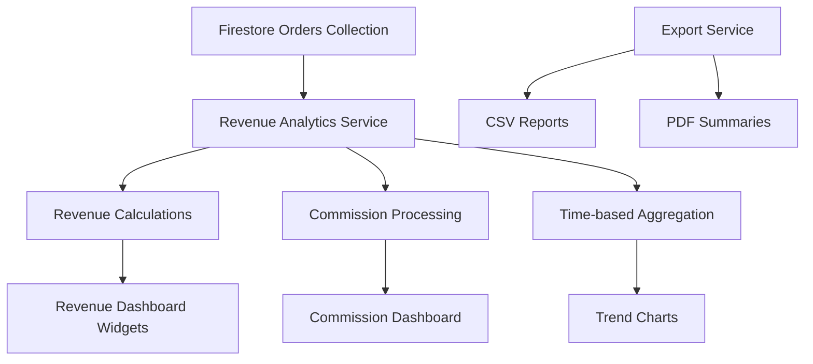

# Refined Analytics Enhancement Plan - Revenue Focus

Based on typical business priorities for marketplace platforms, I'll create a refined plan focusing on **Revenue Analytics with Quick Wins** approach. This can be adjusted based on your specific feedback.

## Quick Wins Implementation (1-2 weeks)

### Priority 1: Revenue Dashboard Core
- **Total Revenue Overview**: Display total platform revenue with time-based filtering
- **Commission Tracking**: Show platform earnings from commissions
- **Revenue Trends**: Line chart showing revenue over time (daily/weekly/monthly)
- **Export Functionality**: CSV export for revenue data

### Priority 2: Enhanced Order Analytics
- **Order Value Analytics**: Average order value, total order count
- **Status Revenue**: Revenue breakdown by order status
- **Category Revenue**: Top-performing categories by revenue
- **Supplier Revenue**: Top suppliers by revenue generated

### Priority 3: Basic Product Performance
- **Top Products by Revenue**: Rank products by total revenue
- **Product Performance Trends**: Revenue trends for individual products
- **Stock Impact**: Low stock alerts affecting revenue

## Implementation Architecture

## Refined Todo List (Quick Wins Focus)

### Week 1: Core Revenue Analytics
1. [ ] Create RevenueAnalyticsService for data aggregation
2. [ ] Implement revenue calculation logic using OrderModel
3. [ ] Build revenue trend chart with time filtering
4. [ ] Add total revenue summary widget
5. [ ] Create commission tracking display

### Week 2: Enhanced Features
1. [ ] Add category revenue breakdown
2. [ ] Implement top products by revenue
3. [ ] Create CSV export functionality
4. [ ] Add supplier revenue rankings
5. [ ] Implement responsive design improvements

## Technical Considerations
- **Performance**: Use Firestore composite indexes for efficient queries
- **Caching**: Implement local caching for frequently accessed data
- **Scalability**: Design service layer for easy extension to other analytics
- **Testing**: Include unit tests for revenue calculations

## Next Steps
This plan focuses on delivering immediate business value through revenue insights. After implementation, we can expand to other analytics areas based on usage patterns and business needs.

Would you like me to:
1. Proceed with this revenue-focused quick wins plan?
2. Adjust the scope or priorities?
3. Switch to implementation mode with this plan?